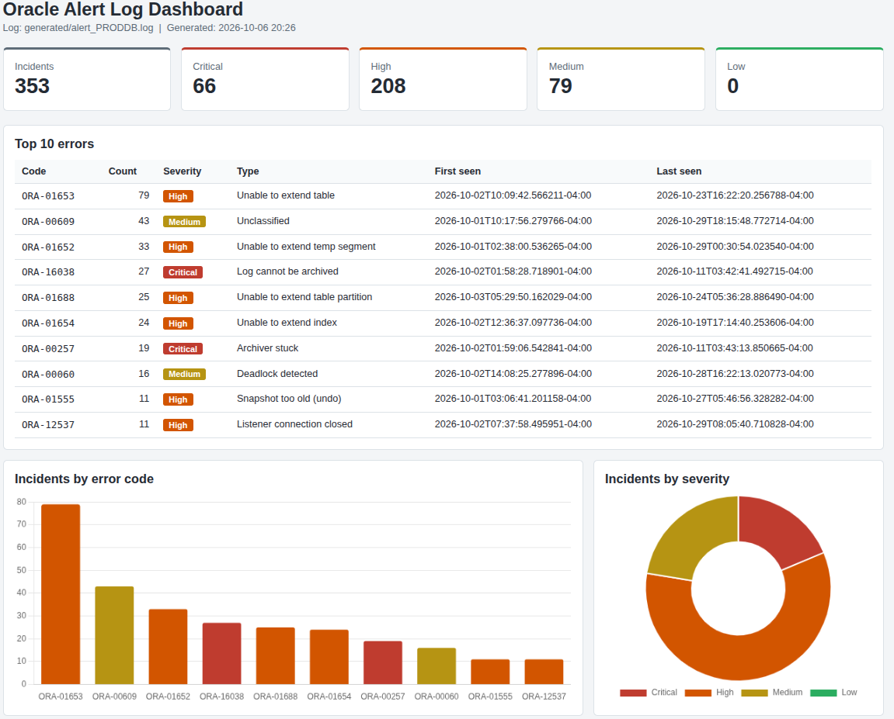

# Oracle Alert Log Analyzer

A Python tool that turns an Oracle alert log into a clear daily health report. It finds every ORA- error, groups error stacks into real incidents, classifies them by type and severity, and produces a terminal summary, a CSV, and an HTML dashboard.

It ships with a realistic alert log simulator that generates Oracle 19c logs with known incidents, so the parser can be tested against ground truth without touching a real database.



## Why this exists

Every morning, on-call DBAs scan alert logs across databases looking for problems. It's slow, it's easy to miss something, and the raw log makes it hard to tell a one-off error from a problem that has been repeating all night. This tool answers the morning-check questions in seconds:

- What went wrong, and how serious is it?
- Which errors happen most often?
- When did each problem first appear, and is it still happening?

## Features

**Analyzer (`oracle_log_parser.py`)**

- **Incident grouping.** The first ORA- code after each timestamp is the incident. Follow-up lines in the same error stack (such as ORA-06512, ORA-01110, ORA-19804) are attached as related codes instead of being counted as separate errors.
- **Accurate classification.** Known Oracle errors are looked up directly (for example ORA-00257 archiver stuck, ORA-01578 block corruption, ORA-19809 recovery area full), with broad fallbacks for unknown codes. Oracle error numbers don't follow neat ranges, so a lookup table is more reliable than number ranges.
- **Code normalization.** `ORA-1653` and `ORA-01653` are treated as the same error.
- **Top errors with first and last seen times**, in both the terminal and the dashboard.
- **Both timestamp formats.** 12c+ ISO timestamps with any time zone offset, and the legacy 11g format. Mixed logs from upgraded databases sort correctly.
- **Scales to large logs.** A 100 MB log parses in a few seconds, and the dashboard stays small (about 200 KB) by showing the latest incidents while the CSV keeps the full list.
- **Safe HTML.** Log text is escaped, so unusual characters in a log line can't break the dashboard.

**Simulator (`generate_alert_log.py`)**

- **Realistic daily rhythm:** busier redo log switches in business hours, nightly RMAN autobackup, maintenance windows, auto-extend resizes.
- **Incidents that unfold over time:**
  - Recovery area fills → archiver stops → repeated ORA-16038 → ORA-00257 → DBA raises the limit → archiver resumes
  - Tablespace full → repeated ORA-1653 → DBA adds a datafile → errors stop
  - Background process dies → PMON terminates the instance → crash recovery on restart
- **Real alert log quirks:** unpadded codes, error stacks, TNS-only network blocks that are not ORA errors, and common noise like ORA-609.
- **Time zones with daylight saving**, ISO or legacy timestamp format.
- **Ground-truth file** (`expected_incidents.csv`) listing every incident written, for testing.
- **Repeatable output** with a fixed random seed.

## Quick start

Requires Python 3.10 or newer. No third-party packages are needed on Linux or macOS. On Windows, also run `pip install tzdata` so the simulator can use time zones.

```bash
git clone git@github.com:YOUR-USERNAME/alert-log-analyzer.git
cd alert-log-analyzer
python3 -m venv .venv
source .venv/bin/activate

# 1. Generate a realistic 30-day alert log
python generate_alert_log.py

# 2. Analyze it
python oracle_log_parser.py generated/alert_PRODDB.log

# 3. Open the dashboard
xdg-open oracle_dashboard.html      # Linux
open oracle_dashboard.html          # macOS
```

## Sample output

```
Alert log: generated/alert_PRODDB.log
Incidents: 353  |  Critical: 66  High: 208  Medium: 79  Low: 0

CODE        COUNT  SEVERITY  TYPE                               FIRST SEEN                        LAST SEEN
--------------------------------------------------------------------------------------------------------------------------------
ORA-01653      79  High      Unable to extend table             2026-10-02T10:09:42.566211-04:00  2026-10-23T16:22:20.256788-04:00
ORA-00609      43  Medium    Unclassified                       2026-10-01T10:17:56.279766-04:00  2026-10-29T18:15:48.772714-04:00
ORA-01652      33  High      Unable to extend temp segment      2026-10-01T02:38:00.536265-04:00  2026-10-29T00:30:54.023540-04:00
ORA-16038      27  Critical  Log cannot be archived             2026-10-02T01:58:28.718901-04:00  2026-10-11T03:42:41.492715-04:00
ORA-01688      25  High      Unable to extend table partition   2026-10-03T05:29:50.162029-04:00  2026-10-24T05:36:28.886490-04:00
... (top 10 shown in the real output)

CSV:       oracle_errors.csv
Dashboard: oracle_dashboard.html
```

The CSV contains one row per incident:

| Timestamp | Error Code | Severity | Type | Related Codes | Error Line |
|---|---|---|---|---|---|
| 2026-10-01T00:00:35.220392-04:00 | ORA-00353 | Critical | Redo log corruption | ORA-00312 | ORA-00353: log corruption near block 38606 ... |

## Usage

### Analyzer

```bash
python oracle_log_parser.py ALERT_LOG [--csv PATH] [--html PATH] [--top N] [--max-rows N]
```

| Option | Default | Description |
|---|---|---|
| `ALERT_LOG` | required | Path to the alert log |
| `--csv` | `oracle_errors.csv` | CSV output with every incident |
| `--html` | `oracle_dashboard.html` | HTML dashboard output |
| `--top` | `10` | Number of top errors to show |
| `--max-rows` | `500` | Latest incidents shown in the dashboard table |

Exits with code 1 if the log file doesn't exist.

The dashboard loads Chart.js from a CDN, so the two charts need an internet connection. Everything else in the dashboard works offline.

### Simulator

```bash
python generate_alert_log.py [options]
```

| Option | Default | Description |
|---|---|---|
| `--days` | `30` | Days of activity to simulate |
| `--size-mb` | none | Keep generating until the log reaches this size. Overrides `--days`. At the default error rate, 1 MB is roughly 50 days of activity, so large sizes span many simulated years |
| `--start` | `2026-10-01` | First day (YYYY-MM-DD) |
| `--tz` | `America/Toronto` | Time zone for timestamps |
| `--db-name` | `PRODDB` | Database name |
| `--format` | `iso` | `iso` (12c+) or `legacy` (11g) timestamps |
| `--error-rate` | `1.0` | Multiply incident frequency |
| `--seed` | `42` | Random seed for repeatable output |
| `--out` | `generated/alert_<DB>.log` | Alert log path |
| `--expected` | next to the log | Ground-truth CSV path |
| `--no-ensure-all` | off | Don't force every incident type to appear in the first week |

Examples:

```bash
python generate_alert_log.py --size-mb 10              # about 10 MB in about a second
python generate_alert_log.py --days 7 --error-rate 3   # a very bad week
python generate_alert_log.py --format legacy           # 11g-style timestamps
```

## How it works

```
alert log ──► read line by line ──► timestamp line?  ──► start a new block
                                    ORA- code line?  ──► first code in block = incident
                                                         later codes = related codes
                     │
                     ▼
              classify each incident (lookup table, then fallbacks)
                     │
         ┌───────────┼─────────────┐
         ▼           ▼             ▼
   terminal summary  CSV      HTML dashboard
   (top N errors)  (every     (KPIs, top errors,
                   incident)   charts, latest incidents)
```

Severity levels:

| Severity | Meaning | Examples |
|---|---|---|
| Critical | Instance crash, hang, corruption, or archiving stopped | ORA-00600, ORA-07445, ORA-00257, ORA-01578, ORA-19809, ORA-04031 |
| High | Service impact likely if not handled soon | ORA-01653, ORA-01652, ORA-01555, ORA-00020, ORA-12537 |
| Medium | Application or concurrency issues | ORA-00060, ORA-03113, ORA-12170 |
| Low | Context lines and minor events | ORA-06512, ORA-01110, ORA-01013 |

To add or change a classification, edit `KNOWN_ERRORS` at the top of `oracle_log_parser.py`.

## Validating the parser

The simulator writes `expected_incidents.csv` alongside every log it generates. Compare it with the analyzer's CSV to confirm every incident was found and grouped correctly:

```bash
python generate_alert_log.py --size-mb 10
python oracle_log_parser.py generated/alert_PRODDB.log
python - <<'EOF'
import csv
from collections import Counter
expected = Counter(r["Primary Code"] for r in csv.DictReader(open("generated/expected_incidents.csv")))
parsed = Counter(r["Error Code"] for r in csv.DictReader(open("oracle_errors.csv")))
print("PASS" if expected == parsed else f"FAIL: {expected - parsed} / {parsed - expected}")
EOF
```

Tested against 30-day, 10 MB, 100 MB, legacy-format, and daylight-saving-change logs, with every incident matching.

## Run it daily with cron

Run the analysis every morning at 7:00 against a real alert log:

```bash
crontab -e
```

```
0 7 * * * cd $HOME/alert-log-analyzer && .venv/bin/python oracle_log_parser.py /u01/app/oracle/diag/rdbms/proddb/PRODDB/trace/alert_PRODDB.log --html reports/dashboard_$(date +\%F).html --csv reports/errors_$(date +\%F).csv >> reports/cron.log 2>&1
```

Create the `reports/` folder first. Note the `\%` in cron, which is required for `date` formats.

## Project structure

```
alert-log-analyzer/
├── oracle_log_parser.py     # analyzer: parse, classify, report
├── generate_alert_log.py    # realistic alert log simulator
├── generated/               # simulated logs and expected_incidents.csv
├── docs/
│   └── dashboard.png        # screenshot used in this README
├── README.md
└── .gitignore
```

Suggested `.gitignore`:

```
.venv/
__pycache__/
*.log
!generated/*.log
oracle_errors.csv
oracle_dashboard.html
reports/
```

## Data and safety

All sample data is synthetic. Never commit real alert logs to a public repository: they contain hostnames, file paths, SQL text, and other details about production systems. The analyzer only reads the log file and never connects to a database.

## Roadmap

- [ ] Unit tests with `pytest` using the simulator's ground truth
- [ ] Classify more codes (ORA-12012 scheduler job failure, ORA-00609 client disconnect)
- [ ] Live mode that tails the log and alerts on new Critical incidents
- [ ] Analyze several databases in one run
- [ ] LLM-generated incident summaries posted to Microsoft Teams (next project)

## Tech

Python 3.10+ standard library (`argparse`, `re`, `csv`, `dataclasses`, `zoneinfo`), Chart.js for dashboard charts.

## About

Built by *Rahul Thakar*, Senior Oracle Apps DBA moving into AI platform engineering. This is project 1 of 26 in a series of real-world projects covering Python, LLMs, AI agents, RAG on Oracle, MCP, and LLMOps on Azure and AWS.

[LinkedIn](https://www.linkedin.com/in/rahulkthakar/) · [GitHub](https://github.com/rahulkthakar)

## License

MIT
